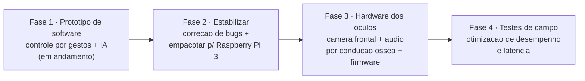

# Roadmap do Jarvis

Roadmap macro do **Jarvis** — software para um par de oculos inteligentes (alvo: Raspberry Pi 3) operado por **controle por gestos**. O fluxo por frame e: camera (OpenCV) -> deteccao de mao (MediaPipe Hands) -> reconhecimento de gesto -> acao (`Control`) -> IA (Google Gemini) e/ou upload (Google Photos) -> resposta falada (edge-tts + pygame).

As fases sao macro e **sem datas fixas** — o sequenciamento relativo esta em [[Cronograma_Macro|Cronograma Macro]]. Cada fase referencia os artefatos de especificacao, teste e decisao que a sustentam.

## Visao de fases

## Fase 1 — Prototipo de software (atual)

Prototipo funcional do software de controle por gestos + IA multimodal, rodando em desktop com webcam (`cv2.VideoCapture(0)`). Esta e a base que sera portada para o hardware.

- [x] Loop assincrono de camera com `asyncio` + `ThreadPoolExecutor` ([[Arquitetura_Software|arquitetura]]; ver [[ADR-0004_Concorrencia_Asyncio_ThreadPool|ADR-0004]])
- [x] Reconhecimento de 5 gestos por geometria de 21 landmarks (MediaPipe) — ver [[RF-006_Reconhecimento_Cinco_Gestos|RF-006]] e [[ADR-0001_MediaPipe_Hands|ADR-0001]]
- [x] Captura de foto via gesto OK + upload automatico ([[RF-001_Captura_Foto_Gesto_Ok|RF-001]], [[RF-009_Upload_Automatico_Google_Photos|RF-009]])
- [x] Gravacao de video via gesto positivo/joinha ([[RF-002_Gravacao_Video_Gesto_Positivo|RF-002]])
- [x] Pergunta por voz -> Gemini -> resposta falada ([[RF-003_Pergunta_Voz_Resposta_Falada|RF-003]], [[RF-007_Resposta_Falada_Persona_Jarvis|RF-007]])
- [x] Analise multimodal: foto + pergunta e video + pergunta ([[RF-004_Foto_Mais_Pergunta_Analise|RF-004]], [[RF-005_Video_Mais_Pergunta_Analise|RF-005]]; ver [[ADR-0002_Gemini_Multimodal|ADR-0002]])
- [x] Persona PT-BR "Jarvis" e TTS com `pt-BR-AntonioNeural` ([[ADR-0003_TTS_EdgeTTS_Pygame|ADR-0003]])
- [x] Debounce por cooldown em frames + trava global de acao ([[RF-008_Debounce_Cooldown_E_Trava_Acao|RF-008]])
- [ ] Validacao manual sistematica dos gestos e fluxos (ver planos [[TP-001_Validacao_Reconhecimento_Gestos|TP-001]], [[TP-002_Validacao_Fluxo_IA_Gemini|TP-002]], [[TP-003_Validacao_Captura_E_Upload|TP-003]])

**Saida da fase:** prototipo demonstravel ponta a ponta em desktop.

## Fase 2 — Estabilizar e empacotar

Tornar o prototipo confiavel e reprodutivel: corrigir bugs conhecidos, limpar `requirements.txt` e empacotar para o alvo Raspberry Pi 3.

- [ ] Corrigir `Video_Audio` chamando `Capture_Audio` sem o argumento `executor` — ver [[BUG-001_Video_Audio_Sem_Executor|BUG-001]]
- [ ] Corrigir `Recycle_midia` definido como metodo sem `self` na assinatura — ver [[BUG-002_Recycle_Midia_Sem_Self|BUG-002]]
- [ ] Confirmar/manter correcao de `ProjectConfig.Config_Project` (uso de `os.makedirs(..., exist_ok=True)` + guard `__main__`) — ver [[BUG-003_ProjectConfig_Mkdir_Sem_ExistOk|BUG-003]]
- [ ] Sanear `requirements.txt` (remover pseudo-pacotes da stdlib `time`/`os`/`pathlib` e o nome generico `google`)
- [ ] Substituir o `time.sleep(10)` bloqueante do polling de video do Gemini (`Video_To_Text`, marcado "Bomba" no codigo) por espera nao-bloqueante
- [ ] Revisar o toggle de `Control_Video` disparado por **qualquer** gesto (quirk do `Check_Gesture`) — ver [[RF-008_Debounce_Cooldown_E_Trava_Acao|RF-008]]
- [ ] Empacotar dependencias e validar execucao no Raspberry Pi 3 — ver [[RNF-001_Execucao_Raspberry_Pi3|RNF-001]] e [[ADR-0007_Alvo_Raspberry_Pi3|ADR-0007]]

**Saida da fase:** build reprodutivel rodando no Raspberry Pi 3, sem os bugs conhecidos.

## Fase 3 — Hardware dos oculos e firmware

Materializar o produto fisico: armacao dos oculos com camera frontal, audio por conducao ossea e a camada de firmware que integra os perifericos ao software.

- [ ] Selecao de camera frontal embarcada (a definir)
- [ ] Selecao do modulo de audio por conducao ossea (a definir)
- [ ] Integracao mecanica/eletrica na armacao dos oculos (a definir)
- [ ] Firmware de bring-up e abstracao dos perifericos (camera, audio, energia) (a definir)
- [ ] Adaptar o software hands-free para a entrada de camera embarcada — ver [[RNF-002_Operacao_Hands_Free|RNF-002]]

**Saida da fase:** prototipo de hardware vestivel integrado ao software.

## Fase 4 — Testes de campo e otimizacao

Validar o produto em uso real e otimizar desempenho/latencia no alvo embarcado.

- [ ] Testes de campo com usuarios reais (a definir)
- [ ] Medicao e otimizacao de latencia da resposta — ver [[RNF-004_Latencia_Resposta|RNF-004]]
- [ ] Otimizacao de desempenho no Raspberry Pi 3 (FPS de deteccao, uso de CPU/memoria) — ver [[RNF-001_Execucao_Raspberry_Pi3|RNF-001]]
- [ ] Avaliacao de dependencia de conectividade e privacidade dos dados na nuvem — ver [[RNF-006_Dependencia_Conectividade|RNF-006]] e [[RNF-005_Privacidade_Dados_Nuvem|RNF-005]]

**Saida da fase:** produto validado em campo, com desempenho aceitavel no alvo.

## Marcos relacionados

O sequenciamento temporal relativo (T0, T0+1, ...) de cada fase esta detalhado em [[Cronograma_Macro|Cronograma Macro]].

## Referencias

- [[Cronograma_Macro|Cronograma Macro]] — marcos de alto nivel ligados a estas fases
- [[Arquitetura_Software|Arquitetura do Software]] — desenho do loop e das classes
- [[Referencia_Modulos|Referencia de Modulos]] — papel de cada arquivo `.py`
- [[Mapa_Gestos|Mapa de Gestos]] — mapeamento gesto -> acao
- Decisoes tecnicas: [[ADR-0001_MediaPipe_Hands|ADR-0001]], [[ADR-0002_Gemini_Multimodal|ADR-0002]], [[ADR-0003_TTS_EdgeTTS_Pygame|ADR-0003]], [[ADR-0004_Concorrencia_Asyncio_ThreadPool|ADR-0004]], [[ADR-0005_Upload_Google_Photos_OAuth|ADR-0005]], [[ADR-0006_Arquitetura_Classe_Por_Arquivo|ADR-0006]], [[ADR-0007_Alvo_Raspberry_Pi3|ADR-0007]]
- Bugs a tratar: [[BUG-001_Video_Audio_Sem_Executor|BUG-001]], [[BUG-002_Recycle_Midia_Sem_Self|BUG-002]], [[BUG-003_ProjectConfig_Mkdir_Sem_ExistOk|BUG-003]]
- [[Home|Home do projeto]]
