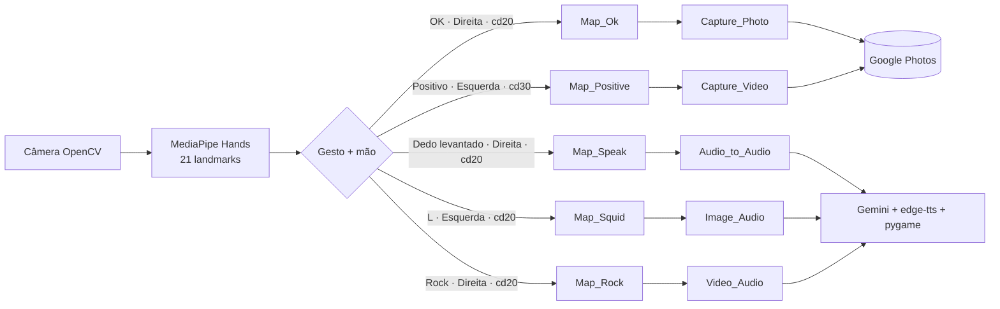

# Mapa de gestos → ações

Tabela mestra que liga cada gesto reconhecido pelo MediaPipe (`Hands.Map_*`) à ação
da classe `Control`, ao caso de uso e ao requisito funcional. Fonte da verdade: a
lista `checks` em [main.py](../../../../main.py) e os métodos em
[hands.py](../../../../hands.py).

## Tabela mestra

| Gesto | Método `Hands.Map_*` | Mão exigida | Cooldown (frames) | Ação `Control` | Caso de uso | Requisito |
|---|---|---|---|---|---|---|
| OK / pinça | `Map_Ok` | Direita | 20 | `Capture_Photo(frame, executor)` | [[CU-001_Tirar_Foto\|CU-001]] | [[RF-001_Captura_Foto_Gesto_Ok\|RF-001]] |
| Positivo / joinha | `Map_Positive` | Esquerda | 30 | `Capture_Video(cap, executor)` | [[CU-002_Gravar_Video\|CU-002]] | [[RF-002_Gravacao_Video_Gesto_Positivo\|RF-002]] |
| Dedo levantado | `Map_Speak` | Direita | 20 | `Audio_to_Audio(executor)` | [[CU-003_Perguntar_Por_Voz\|CU-003]] | [[RF-003_Pergunta_Voz_Resposta_Falada\|RF-003]] |
| "L" | `Map_Squid` | Esquerda | 20 | `Image_Audio(frame, executor)` | [[CU-004_Analisar_Imagem_Com_Pergunta\|CU-004]] | [[RF-004_Foto_Mais_Pergunta_Analise\|RF-004]] |
| Rock | `Map_Rock` | Direita | 20 | `Video_Audio(cap, executor)` | [[CU-005_Analisar_Video_Com_Pergunta\|CU-005]] | [[RF-005_Video_Mais_Pergunta_Analise\|RF-005]] |

## Diagrama gesto → ação

## Geometria de cada gesto

Convenção: os 21 landmarks têm coordenadas normalizadas, convertidas para pixels
(`x*w`, `y*h`). O eixo **Y cresce para baixo** — logo, "y menor" significa ponto
mais **alto** na imagem. Thresholds relativos a `0.05*w` ou `0.05*h`.

| Gesto | Critérios (resumo) |
|---|---|
| **Map_Ok** | Polegar (4) e indicador (8) quase tocando: distância `< 0.05*w` (pinça); indicador dobrado (`indicador_5_y > indicador_6_y`); polegar abaixo da junta do indicador (`polegar_1_y > indicador_6_y`); polegar lateralizado (`polegar_3_x > indicador_5_x`). |
| **Map_Positive** | Polegar levantado (`polegar_4_y < polegar_1_y - 0.05*h`); indicador, médio, anelar e mindinho **dobrados** (ponta com y maior que a junta correspondente). |
| **Map_Speak** | Só o indicador levantado (`indicador_8_y < indicador_5_y - 0.05*h`); polegar lateral (`polegar_4_x > polegar_1_x`); médio, anelar e mindinho dobrados. |
| **Map_Squid** | Indicador levantado (`indicador_8_y < indicador_6_y - 0.05*h`); polegar aberto para o lado oposto (`polegar_4_x < polegar_2_x`); médio, anelar e mindinho dobrados → "L". |
| **Map_Rock** | Indicador levantado (`indicador_8_y < indicador_6_y - 0.05*h`) **e** mindinho levantado (`mindinho_20_y < mindinho_18_y - 0.05*h`); médio e anelar dobrados → "chifres". |

## Mecânica de disparo (main.py)

- Para cada mão detectada, percorre a lista `checks`; só avalia um gesto se
  `Control.ACTION == False` **e** `gesture_cooldown == 0`.
- `Check_Gesture` exige `Map_* == True` **e** `hand_label == side`. Ao confirmar:
  define `gesture_cooldown = <cooldown>` e dispara a ação no `ThreadPoolExecutor`.
- `gesture_cooldown` decai 1 por frame (debounce). Ver
  [[RF-008_Debounce_Cooldown_E_Trava_Acao|RF-008]].
- **Quirk (toggle global):** todo gesto `Async` executa
  `Control_Video = not Control_Video` em `Check_Gesture`. Isso liga/desliga a
  gravação de vídeo a **cada** ação, não só no gesto positivo — acoplamento a ser
  observado.

## Quirks e pontos de atenção

| Item | Onde | Efeito |
|---|---|---|
| Toggle de `Control_Video` em todo gesto | `Check_Gesture` (main.py) | Gravação liga/desliga fora de hora |
| Som de áudio usa `video_starter.wav` | `Capture_Audio` (control.py) | Confirmação sonora "errada" mas funcional |
| Upload sempre `image/jpeg` | `Manager.uploadMidia` | Vídeo `.avi` pode ser rejeitado pelo Photos |
| `Capture_Audio` chamado sem `executor` | `Video_Audio` (control.py) | `TypeError` → ver [[BUG-001_Video_Audio_Sem_Executor]] |
| `time.sleep(10)` bloqueante no polling de vídeo | `Video_To_Text` (jarvis.py) | Trava a thread durante o processamento |
| `calculusNormalDistance` desativado | main.py (comentado) | Estimativa de distância da mão não usada |

## Referências

- [[CU-001_Tirar_Foto|CU-001 · Tirar foto]]
- [[CU-002_Gravar_Video|CU-002 · Gravar vídeo]]
- [[CU-003_Perguntar_Por_Voz|CU-003 · Perguntar por voz]]
- [[CU-004_Analisar_Imagem_Com_Pergunta|CU-004 · Analisar imagem com pergunta]]
- [[CU-005_Analisar_Video_Com_Pergunta|CU-005 · Analisar vídeo com pergunta]]
- [[RF-006_Reconhecimento_Cinco_Gestos|RF-006 · Reconhecimento dos cinco gestos]]
- [[Ref_MediaPipe_Hands|Referência: MediaPipe Hands]]
- [[Arquitetura_Software|Arquitetura do software]]
- [[Referencia_Modulos|Referência dos módulos]]
