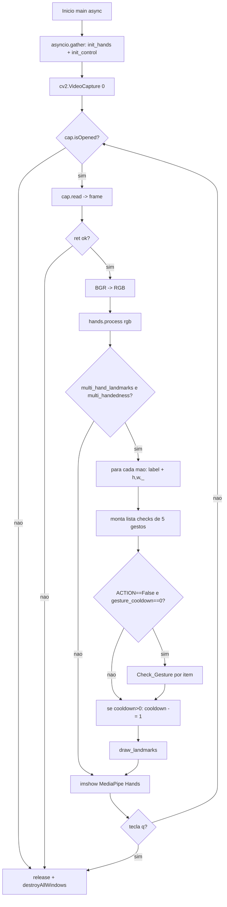
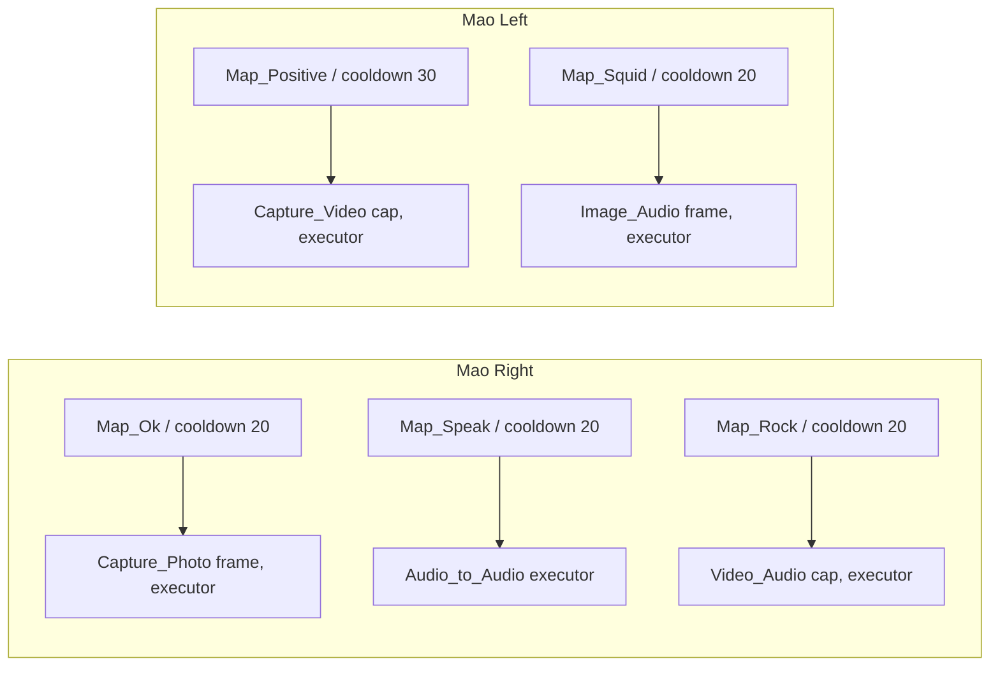
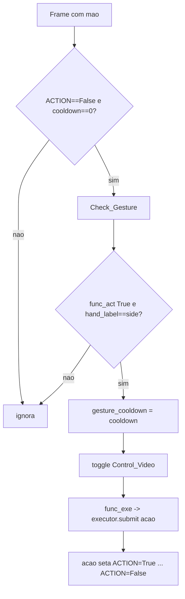
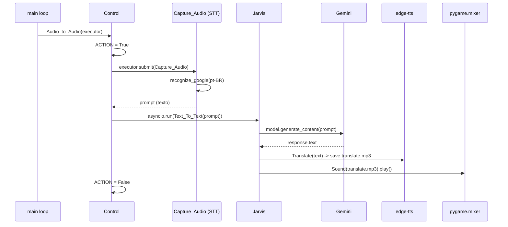
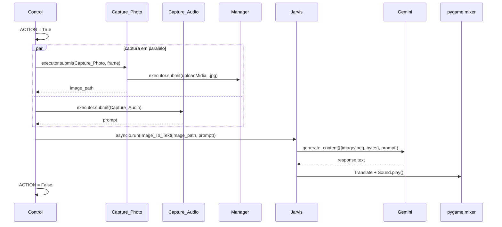
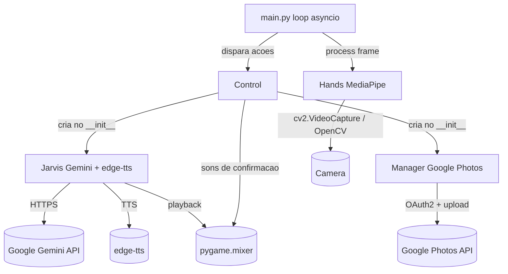

# Arquitetura do Software Jarvis

Documento central de arquitetura do app **Jarvis** — software para um par de oculos
inteligentes (alvo: Raspberry Pi 3) operado por **controle por gestos**. Toda a
descricao abaixo foi conferida diretamente contra o codigo-fonte (`main.py`,
`hands.py`, `control.py`, `jarvis.py`, `manager.py`, `ProjectConfig.py`).

## 1. Visao geral

O sistema e um loop `asyncio` de visao computacional. A cada frame da camera ele
detecta a(s) mao(s), reconhece um gesto por geometria dos landmarks e dispara uma
acao. Acoes podem capturar midia, consultar a IA multimodal (Google Gemini) e/ou
fazer upload para o Google Photos, sempre terminando com uma **resposta falada**.

```text
camera (OpenCV) -> deteccao de mao (MediaPipe) -> reconhecimento de gesto
  -> acao (Control) -> IA (Gemini) e/ou upload (Google Photos)
  -> resposta falada (edge-tts -> pygame.mixer)
```

- **Entry point real**: `python main.py` (tecle `q` na janela do OpenCV para sair).
  O README da raiz aponta `python jarvis.py`, o que esta **desatualizado** —
  `jarvis.py` apenas define a classe `Jarvis`, sem bloco `__main__`.
- **Sem testes/linter**: a validacao e manual, rodando o app. Ver
  [[TP-001_Validacao_Reconhecimento_Gestos]],
  [[TP-002_Validacao_Fluxo_IA_Gemini]] e [[TP-003_Validacao_Captura_E_Upload]].
- **Bootstrap**: `python ProjectConfig.py` cria `response/` e `midia/` e um `.env`
  vazio (idempotente). `.env` precisa de `API_GEMINI=<chave>`. O upload exige
  `env/client_secret.json` (OAuth desktop) e gera `env/token.json` no primeiro uso.

## 2. Estrutura: arquivo -> classe -> papel

Uma classe por arquivo, instanciadas em cadeia (`Control` cria `Jarvis` e `Manager`).
Ver [[ADR-0006_Arquitetura_Classe_Por_Arquivo|ADR-0006]].

| Arquivo | Classe | Papel |
|---|---|---|
| `main.py` | — | Loop `asyncio` da camera. Por mao detectada, percorre a lista `checks` e dispara a acao via `ThreadPoolExecutor`. Hospeda `gesture_cooldown` (global) e `Check_Gesture`. |
| `hands.py` | `Hands` | Wrapper do MediaPipe Hands. Cada `Map_*` recebe `(h, w, hand_landmarks, frame)` e retorna `True` quando a pose e detectada (geometria dos 21 landmarks). |
| `control.py` | `Control` | Orquestra as acoes: captura de foto/video/audio, toca sons de confirmacao (`audios_check/`) e encadeia os fluxos do Jarvis. Detem as travas `ACTION` e `Control_Video`. |
| `jarvis.py` | `Jarvis` | Cliente do Gemini (`gemini-2.0-flash-lite`) com persona PT-BR. Converte a resposta em fala (`edge-tts`, voz `pt-BR-AntonioNeural`) e toca via `pygame.mixer`. |
| `manager.py` | `Manager` | Upload de midia para o Google Photos via OAuth2. |
| `ProjectConfig.py` | — | Bootstrap das pastas (`response/`, `midia/`) e do `.env`. Idempotente (`os.makedirs(exist_ok=True)`), com guard `__main__`. |

Detalhamento por metodo em [[Referencia_Modulos]].

## 3. Loop por frame



Observacoes do loop:

- `init_hands()` / `init_control()` rodam os **construtores sincronos** `Hands()` e
  `Control()` em `loop.run_in_executor`, para nao bloquear o `asyncio` na partida.
- `hand_label = hand_handedness.classification[0].label` -> `"Right"` ou `"Left"`.
- A funcao `calculusNormalDistance` (estimativa de distancia da mao pelos landmarks 5
  e 17) esta **comentada/desativada**, assim como a clausula `(Dx < 150 or Dy < 150)`.

## 4. Mapa gesto -> acao

A lista `checks` em `main.py` associa cada gesto a uma acao, a mao exigida e um
cooldown (em frames). Cada item e a tupla
`(func_exe, func_act, side, state, cooldown)`; todas usam `state == "Async"`.



| Gesto (`Hands.Map_*`) | Mao | Cooldown | Acao (`Control`) | Caso de uso |
|---|---|---|---|---|
| OK / pinca (`Map_Ok`) | Right | 20 | `Capture_Photo` — foto + upload | [[CU-001_Tirar_Foto]] |
| Joinha (`Map_Positive`) | Left | 30 | `Capture_Video` — grava enquanto `Control_Video` | [[CU-002_Gravar_Video]] |
| Dedo levantado (`Map_Speak`) | Right | 20 | `Audio_to_Audio` — voz -> Gemini -> fala | [[CU-003_Perguntar_Por_Voz]] |
| "L" (`Map_Squid`) | Left | 20 | `Image_Audio` — foto + voz -> Gemini | [[CU-004_Analisar_Imagem_Com_Pergunta]] |
| Rock (`Map_Rock`) | Right | 20 | `Video_Audio` — video + voz -> Gemini | [[CU-005_Analisar_Video_Com_Pergunta]] |

A geometria de cada gesto esta detalhada em [[Mapa_Gestos]] e em
[[RF-006_Reconhecimento_Cinco_Gestos]].

## 5. Modelo de concorrencia

Combina `asyncio` (loop principal) com `ThreadPoolExecutor` (trabalho sincrono
pesado). Decisao registrada em [[ADR-0004_Concorrencia_Asyncio_ThreadPool|ADR-0004]].

### 5.1 Mecanismos

| Mecanismo | Onde vive | Funcao |
|---|---|---|
| `Control.ACTION` (bool) | `control.py` | **Trava global**: impede disparar nova acao enquanto outra roda. Acoes setam `True` no inicio e `False` no fim. O loop so chama `Check_Gesture` se `ACTION == False`. |
| `gesture_cooldown` (int) | `main.py` (global) | **Debounce em frames**: setado para `cooldown` ao disparar; decrementado 1 por frame. Enquanto `> 0`, nenhum gesto dispara. |
| `Control.Control_Video` (bool) | `control.py` | Liga/desliga a gravacao de video. `Capture_Video` grava em loop `while self.Control_Video`. |
| `ThreadPoolExecutor` | `main.py` / `control.py` | Roda acoes sincronas pesadas fora do loop async (`executor.submit`). Dentro delas, codigo async e chamado com `asyncio.run(...)`. |

### 5.2 QUIRK: todo gesto alterna `Control_Video`

Em `Check_Gesture`, quando `state == "Async"` (caso de **todos** os 5 gestos), antes
de chamar `func_exe()` o codigo executa:

```python
control_functions.Control_Video = not control_functions.Control_Video
```

Ou seja, **qualquer** gesto reconhecido faz toggle da flag de gravacao — nao apenas o
gesto de video (`Map_Positive`). Na pratica a gravacao so e iniciada/encerrada de
forma previsivel se o gesto Positivo for usado como "par" (liga em uma deteccao,
desliga na seguinte), e outros gestos podem inverter esse estado de forma colateral.
Documentado tambem em [[RF-008_Debounce_Cooldown_E_Trava_Acao]].

### 5.3 Fluxo de uma deteccao



## 6. Fluxos de IA (sequenceDiagram)

Os tres fluxos que consultam o Gemini compartilham o final: a resposta em texto vira
fala (`Translate` -> `edge-tts` -> mp3 -> `pygame.mixer`). Persona e voz em
[[RF-007_Resposta_Falada_Persona_Jarvis]] e [[ADR-0003_TTS_EdgeTTS_Pygame|ADR-0003]].

### 6.1 Audio_to_Audio (gesto Map_Speak)



### 6.2 Image_Audio (gesto Map_Squid)



### 6.3 Video_Audio (gesto Map_Rock)

```mermaid
sequenceDiagram
  participant C as Control
  participant CV as Capture_Video
  participant CA as Capture_Audio
  participant J as Jarvis
  participant G as Gemini
  participant P as pygame.mixer
  C->>CV: executor.submit(Capture_Video, cap, executor)
  Note over CV: grava enquanto Control_Video; upload .avi
  C->>CA: executor.submit(Capture_Audio)
  Note over CA: BUG-001 -- chamado SEM o argumento executor
  CV-->>C: video_path
  CA-->>C: prompt
  C->>C: ACTION = True
  C->>J: asyncio.run(Video_To_Text(video_path, prompt))
  J->>G: upload_file + poll PROCESSING (time.sleep 10, bloqueante)
  G-->>J: response.text
  J->>P: Translate + Sound.play()
  J->>G: Delete_Cahche_Files()
  C->>C: ACTION = False
```

## 7. Diagrama de componentes / classes



- `main.py` **consome** `Hands` (deteccao) e `Control` (acoes); nao conhece `Jarvis`
  nem `Manager` diretamente.
- `Control` **cria** `Jarvis` e `Manager` no `__init__` (composicao). O `mixer` do
  pygame e inicializado em `control.py` e injetado em `Jarvis(mixer)`.

## 8. Armadilhas conhecidas

| Tema | Detalhe | Nota |
|---|---|---|
| Entry point | `python main.py`, nao `jarvis.py` (README desatualizado). | — |
| Paths relativos | Rodar sempre da raiz; `response/` e `midia/` precisam existir; `env/` guarda os segredos OAuth. | — |
| `requirements.txt` | Inclui pseudo-pacotes da stdlib (`time`, `os`, `pathlib`) e nome generico (`google`) que podem quebrar o `pip install`. Instalar manualmente o que faltar. | [[Instalacao_Dependencias]] |
| `Video_Audio` chama `Capture_Audio` sem `executor` | `Capture_Audio(self, executor)` exige o argumento, mas e chamado como `executor.submit(self.Capture_Audio)`. | [[BUG-001_Video_Audio_Sem_Executor]] |
| `Recycle_midia` sem `self` | Definido como metodo (`def Recycle_midia(midia_path)`) mas sem `self` na assinatura. | [[BUG-002_Recycle_Midia_Sem_Self]] |
| `ProjectConfig` `os.mkdir` | Historicamente usava `os.mkdir` sem `exist_ok` (estourava `FileExistsError` na 2a execucao). O codigo **atual** ja usa `os.makedirs(..., exist_ok=True)` e guard `__main__`. | [[BUG-003_ProjectConfig_Mkdir_Sem_ExistOk]] |
| `uploadMidia` sempre `image/jpeg` | Header `X-Goog-Upload-Content-Type: image/jpeg` e `Content-Type` fixos, mesmo quando o arquivo e video `.avi`. | [[ADR-0005_Upload_Google_Photos_OAuth]] |
| `Capture_Audio` toca som de video | Usa `video_start_sound` ao iniciar captura de audio (em vez de `audio_start_sound`). | — |
| `Video_To_Text` bloqueante | Poll de `PROCESSING` com `time.sleep(10)` (sincrono); o proprio comentario do codigo diz "Bomba, precisa ser limpo". | [[RNF-004_Latencia_Resposta]] |
| `photo_url` descartado | `Manager.uploadMidia` calcula `photo_url` via `getPhotoUrl`, mas nao retorna nem usa o valor. | — |

## 9. Referencias

- [[Referencia_Modulos]] — referencia detalhada por classe/metodo
- [[Mapa_Gestos]] — geometria dos 5 gestos
- [[RF-006_Reconhecimento_Cinco_Gestos]], [[RF-008_Debounce_Cooldown_E_Trava_Acao]]
- [[RNF-001_Execucao_Raspberry_Pi3]], [[RNF-004_Latencia_Resposta]]
- ADRs: [[ADR-0001_MediaPipe_Hands]], [[ADR-0002_Gemini_Multimodal]],
  [[ADR-0003_TTS_EdgeTTS_Pygame]], [[ADR-0004_Concorrencia_Asyncio_ThreadPool]],
  [[ADR-0005_Upload_Google_Photos_OAuth]], [[ADR-0006_Arquitetura_Classe_Por_Arquivo]],
  [[ADR-0007_Alvo_Raspberry_Pi3]]
- Bugs: [[BUG-001_Video_Audio_Sem_Executor]], [[BUG-002_Recycle_Midia_Sem_Self]],
  [[BUG-003_ProjectConfig_Mkdir_Sem_ExistOk]]
- Referencias externas: [[Ref_MediaPipe_Hands]], [[Ref_Google_Gemini_API]],
  [[Ref_Edge_TTS]], [[Ref_OpenCV]], [[Ref_Google_Photos_API]],
  [[Ref_SpeechRecognition]], [[Ref_Pygame_Mixer]]
