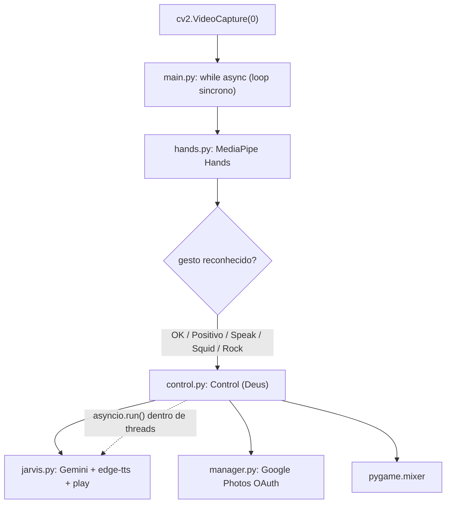
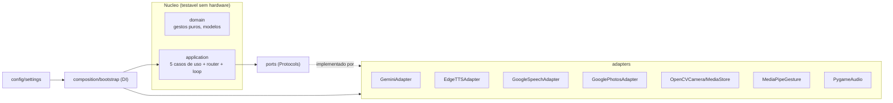

# Avaliacao e plano de refatoracao hexagonal do Jarvis

> **Status: proposto.** Este documento e SO o plano — nenhum codigo foi alterado.
> Aprovar/ajustar antes de iniciar a Onda 1.

## Sumario executivo

O Jarvis funciona e tem um nucleo de ideias bom (gestos -> acoes -> IA -> voz),
mas a arquitetura atual mistura responsabilidades, acopla diretamente aos
provedores externos (Gemini, edge-tts, Google Photos, OpenCV, pygame) e tem um
modelo de concorrencia fragil (asyncio + ThreadPoolExecutor misturados, com
`asyncio.run` dentro de threads). Ha **1 bug critico** (gesto Rock quebrado),
**5 defeitos de severidade alta** (concorrencia/bloqueio/segredos) e poluicao de
repo/dependencias.

- **Decisao tomada pelo dono:** migrar para **arquitetura Hexagonal (Ports &
  Adapters)**, provedores atras de interfaces, com testes, type hints/lint e
  config/segredos saneados; empacotamento via `pyproject.toml` + `uv`.
- **Recomendacao honesta (ver [Advogado do diabo](#parte-4--advogado-do-diabo)):**
  hexagonal completo provavelmente e **overkill** para um produto de 5 casos de
  uso num Raspberry Pi 3. O ganho real buscado e **testabilidade**, que se
  obtem com injecao de dependencia + fakes mesmo sem o cerimonial completo.
  Sugiro decidir entre o alvo hexagonal puro e um **hexagonal seletivo/parada
  pragmatica** (Ondas 1-4 + ports so onde paga) antes de executar.

---

## Parte 1 — Julgamento da arquitetura atual

### 1.1 Fluxo atual



### 1.2 Problemas estruturais

| # | Problema | Evidencia | Principio ferido |
|---|----------|-----------|------------------|
| E1 | `Control` e uma **classe-Deus**: captura de foto/video/audio, orquestracao de IA, sons e regra de negocio juntos | [control.py](../../control.py) (toda a classe) | SRP |
| E2 | **Acoplamento direto** aos provedores; sem interface alguma. Trocar Gemini ou testar sem rede e impossivel | jarvis.py, manager.py, control.py | DIP / Inversao de dependencia |
| E3 | **Tudo na raiz** do repo, sem pacote, sem `src/`, sem `tests/` | layout do repo | Organizacao de pastas |
| E4 | **Concorrencia incoerente**: `async` por fora, `ThreadPoolExecutor` por dentro, `asyncio.run()` por thread; `nest-asyncio` no requirements e sintoma | main.py, control.py | Modelo de execucao |
| E5 | **Funcoes de gesto repetitivas** (Map_Ok/Positive/Speak/Squid/Rock quase identicas) e acopladas ao objeto MediaPipe | [hands.py](../../hands.py) | DRY / testabilidade |
| E6 | **Sem config central**: `.env`, paths, vozes, thresholds e scopes espalhados como literais | varios | Configuracao |
| E7 | **Sem rede de testes**, sem type hints, sem lint | repo | Qualidade |

### 1.3 Defeitos verificados (verificacao adversarial)

> Cada item foi confirmado lendo o codigo (`e_real=true`), exceto o ultimo.

| Sev. | Defeito | Local |
|------|---------|-------|
| **CRITICA** | `Video_Audio` chama `self.Capture_Audio` **sem** o argumento `executor` obrigatorio -> `TypeError`, gesto **Rock sempre quebra** | [control.py:109](../../control.py) |
| ALTA | `asyncio.run()` dentro de threads do `ThreadPoolExecutor` cria/destroi event loops por chamada (fragil; `nest-asyncio` e sintoma) | control.py:40,50,55,71,93,103,113 |
| ALTA | `time.sleep(10)` **bloqueante** no polling de `Video_To_Text` (async) — o proprio codigo chama de "Bomba" | [jarvis.py:93](../../jarvis.py) |
| ALTA | Loop de captura **sincrono** dentro de `main()` async **nunca cede** o event loop; o `await` em `Check_Gesture` e enganoso (sem suspensao real) | main.py:25-71 |
| ALTA | `Control_Video` como flag de parada **sem sincronizacao**, em **busy-loop 100% CPU**; **todo** gesto Async faz `Control_Video = not Control_Video`, corrompendo o estado de gravacao | main.py:92-94 / control.py:51 |
| ALTA | **Sem `.gitignore`** para `.env`, `env/`, `token.json`, `client_secret.json` — risco de versionar credenciais OAuth + chave Gemini | .gitignore |
| MEDIA | `requirements.txt` lista **stdlib** (`time`, `os`, `pathlib`), `google` (meta-pacote errado), **falta `requests`**, sem pinning | requirements.txt |
| MEDIA | `ProjectConfig.py` roda **efeito colateral no import**; `os.mkdir` sem `exist_ok` quebra na 2a vez; handle de `.env` vazado | ProjectConfig.py:4-9 |
| MEDIA | `uploadMidia` envia `.avi` com header **`image/jpeg` hardcoded** — upload de video corrompido/rejeitado | manager.py:47 |
| BAIXA | `Capture_Audio` retorna strings de erro ("Sem Pergunta"...) que viram **prompt** ao Gemini — mistura canal de erro/dados | control.py:79-84 |
| BAIXA | `Recycle_midia(midia_path)` **sem `self`** (codigo morto, bug latente; midia local nunca e limpa) | control.py:31 |
| BAIXA | `__pycache__/*.pyc` **versionados** (inclui bytecode de Python 3.9 e 3.12) | repo |
| info | `gesture_cooldown` global mutavel — divida de design, **nao** reproduz bug hoje (thread unica) | main.py:8,64,89 |

### 1.4 Pontos fortes (preservar)

- A separacao conceitual gesto -> acao -> IA -> voz e clara e correta.
- `hands.py` ja isola a deteccao de gestos (basta torna-la pura).
- O uso de Gemini multimodal (texto/imagem/video) e bem aproveitado.
- `manager.py` ja encapsula o OAuth do Google Photos num lugar.

---

## Parte 2 — Arquitetura-alvo (Hexagonal / Ports & Adapters)

### 2.1 Regra de dependencia

`domain  <-  ports  <-  application  <-  adapters`, montados no `composition`.
O **nucleo** (domain + application) nunca importa `cv2`, `mediapipe`, `genai`,
`edge_tts`, `pygame` ou `requests`. Toda lib externa vive em `adapters/`.



### 2.2 Arvore de pastas proposta

```
jarvis/                              # repo root (pacote instalavel via uv)
├── pyproject.toml                   # build, deps, ruff, mypy, pytest
├── uv.lock
├── .env.example                     # template de variaveis (sem segredos)
├── .gitignore                       # .env, secrets/, response/, midia/, __pycache__/
├── secrets/                         # runtime, gitignored (OAuth)
│   ├── client_secret.json
│   └── token.json
├── assets/sounds/                   # ex-audios_check/ (sons de confirmacao)
├── response/                        # runtime (gitignored) — TTS gerado
├── midia/                           # runtime (gitignored) — fotos/videos
├── src/jarvis/
│   ├── __main__.py                  # `python -m jarvis` -> bootstrap
│   ├── domain/                      # nucleo puro, ZERO libs externas
│   │   ├── models.py                # GestureType, Frame, MediaRef, Question...
│   │   ├── gestures.py              # ex-Map_* como funcoes puras sobre landmarks
│   │   └── errors.py
│   ├── ports/                       # interfaces (typing.Protocol)
│   │   ├── llm_provider.py  speech_to_text.py  text_to_speech.py
│   │   ├── media_uploader.py  camera_source.py  audio_player.py
│   │   └── gesture_recognizer.py  media_store.py
│   ├── application/
│   │   ├── use_cases/               # take_photo, record_video, ask_assistant,
│   │   │                            #   analyze_image, analyze_video
│   │   ├── services/                # gesture_router, action_lock
│   │   └── frame_loop.py            # ex-while cap.isOpened()
│   ├── adapters/
│   │   ├── llm/gemini_adapter.py    stt/google_speech_adapter.py
│   │   ├── tts/edge_tts_adapter.py  uploader/google_photos_adapter.py
│   │   ├── camera/opencv_camera_adapter.py  audio/pygame_audio_adapter.py
│   │   ├── gesture/mediapipe_gesture_adapter.py
│   │   └── storage/opencv_media_store.py
│   ├── config/settings.py           # pydantic-settings (SecretStr p/ chave)
│   └── composition/bootstrap.py     # build_app(): DI explicita
└── tests/                           # pytest, sem hardware (fakes por port)
    ├── conftest.py  fakes/  unit/  integration/
```

### 2.3 Camadas

| Camada | Responsabilidade | Depende de |
|--------|------------------|------------|
| `domain` | Modelos + regras puras (classificacao de gesto sobre landmarks). Sem I/O. | nada |
| `ports` | Contratos `Protocol` que o app exige | domain (tipos) |
| `application` | 5 casos de uso, `gesture_router` (ex-`Check_Gesture`), `frame_loop`, `action_lock` | domain + ports |
| `adapters` | Implementacoes concretas com as libs externas; isola async/bloqueio aqui | ports + domain |
| `config` | `Settings` tipado lendo `.env`/env | — |
| `composition` | Composition root: instancia adapters, injeta nos use cases | tudo |

### 2.4 Ports (interfaces)

| Port | Metodos (essenciais) | Substitui |
|------|----------------------|-----------|
| `LLMProvider` | `generate_text`, `generate_from_image`, `generate_from_video` | jarvis.py 71-103 |
| `SpeechToText` | `transcribe(language, timeout, phrase_limit) -> str` | control.py 60-84 |
| `TextToSpeech` | `synthesize(text, out_path) -> MediaRef` | jarvis.py 51-67 |
| `AudioPlayer` | `play_and_wait(media)` | play+sleep espalhado |
| `MediaUploader` | `upload(media) -> str` | manager.py |
| `CameraSource` | `read() -> Frame \| None`, `release()`, context manager | cv2.VideoCapture |
| `GestureRecognizer` | `detect(frame) -> list[HandObservation]` | hands.process |
| `MediaStore` | `save_photo`, `record_video`, `delete` | cv2.imwrite/VideoWriter + Recycle_midia |

### 2.5 Adapters

`GeminiAdapter` (google-generativeai), `GoogleSpeechAdapter` (SpeechRecognition),
`EdgeTTSAdapter` (edge-tts), `GooglePhotosAdapter` (OAuth+requests),
`OpenCVCameraAdapter` + `OpenCVMediaStore` (cv2), `PygameAudioAdapter` (pygame),
`MediaPipeGestureAdapter` (mediapipe). Cada um encapsula o `run_in_executor` das
chamadas bloqueantes — a concorrencia some do nucleo.

### 2.6 Composition root

`src/jarvis/composition/bootstrap.py::build_app(settings)` e o **unico** ponto
que conhece todas as camadas: le `Settings`, instancia os adapters concretos,
injeta-os nos use cases (construtor recebe **interfaces**, nunca cria adapters),
monta o `GestureRouter` + `ActionLock` (substitui flags globais `ACTION`/
`Control_Video`) e o `FrameLoop`. `__main__.py` chama `asyncio.run(app.run())`.

### 2.7 Config e segredos

`pydantic-settings` (`BaseSettings`) — leve para o RPi3. `gemini_api_key:
SecretStr` (obrigatorio), modelo/voz/thresholds/fps/cooldowns/paths com defaults.
OAuth movido para `secrets/` (gitignored), caminhos via `Settings`. Dirs de
runtime criados de forma **idempotente** (`mkdir(parents=True, exist_ok=True)`)
no bootstrap — fim do `ProjectConfig.py` quebrado.

### 2.8 Mapeamento DE -> PARA (resumo)

| De (hoje) | Para (alvo) |
|-----------|-------------|
| `main.py` loop while | `application/frame_loop.py` |
| `main.py` checks + `Check_Gesture` | `application/services/gesture_router.py` |
| `hands.py` `Map_*` | `domain/gestures.py` (puras) |
| `control.py` Capture_Photo/Video/Audio | use cases + `MediaStore`/`SpeechToText` adapters |
| `control.py` flags ACTION/Control_Video | `application/services/action_lock.py` |
| `jarvis.py` (Gemini+TTS+play) | `LLMProvider` + `TextToSpeech` + `AudioPlayer` adapters |
| `manager.py` (Photos) | `adapters/uploader/google_photos_adapter.py` |
| `ProjectConfig.py` | `config/settings.py` + bootstrap idempotente |
| `requirements.txt` | `pyproject.toml` + `uv.lock` (saneado) |
| `audios_check/` | `assets/sounds/` |
| `./env/*.json` | `secrets/*.json` (gitignored) |

---

## Parte 3 — Plano de refatoracao (10 ondas)

**Racional:** reduzir risco antes de reestruturar. Ondas 1-2 estabilizam (bugs,
concorrencia, segredos) **sem** mexer na arquitetura. Onda 3 instala a rede de
testes **antes** de mover codigo. Onda 4 extrai logica pura (alto valor, baixo
risco). Ondas 5-8 introduzem ports/adapters um dominio por vez (padrao
*strangler fig*: o adapter envolve o codigo legado, preservando paridade). Onda 9
troca o nucleo. Onda 10 limpa e endurece. Cada onda e revertivel via `git` e
validavel **sem hardware** (fakes nos ports).

| Onda | Nome | Entrega | Risco |
|------|------|---------|-------|
| 1 | Estabilizar dores criticas | Bug Video_Audio, asyncio.run/sleep, toggle Control_Video, Recycle_midia | Medio-alto |
| 2 | Saneamento | `.gitignore` segredos, requirements limpo, `.env.example`, ProjectConfig idempotente | Baixo |
| 3 | Tooling (rede de seguranca) | `pyproject`+`uv`, ruff, mypy, pytest + smoke | Baixo-medio |
| 4 | Dominio puro | `Map_*` -> funcoes puras testadas | Baixo |
| 5 | Port de config | `Settings` tipado, injetado | Baixo |
| 6 | Ports LLM + TTS + AudioPlayer | Gemini/edge-tts atras de ports + fakes | Medio |
| 7 | Port de storage | Google Photos atras de port + fake | Baixo-medio |
| 8 | Ports camera + microfone | OpenCV/SpeechRecognition atras de ports + fakes | Medio |
| 9 | Nucleo hexagonal | 5 use cases + DI + composition root + loop; remove `Control` | **Alto** |
| 10 | Finalizacao | Remove legado, mypy estrito, docs, smoke em RPi3 | Baixo (codigo) |

### Detalhe — Onda 1 (as dores prioritarias)

1. `control.py:109` -> `executor.submit(self.Capture_Audio, executor)`.
2. Mover `ACTION = True` para o inicio de `Video_Audio` (paridade com os outros).
3. Eliminar `asyncio.run()` nos workers: versao sincrona de `play_confirmation_sound`; para o Jarvis, loop dedicado por thread (`new_event_loop`+`run_until_complete`) **ou** tornar metodos sincronos — escolher o que preserva paridade com menor mudanca e registrar.
4. `jarvis.py:93`: `time.sleep(10)` -> backoff nao-bloqueante (`asyncio.sleep`) com timeout.
5. `main.py:92-94`: restringir o toggle de `Control_Video` **apenas** aos gestos que gravam video (hoje todo gesto Async alterna a flag).
6. `control.py:31`: `Recycle_midia` ganha `self`/`@staticmethod`.

> Cada correcao em **commit atomico** para rollback granular. Checkpoint: import
> sem erro + revisao linha-a-linha + smoke com hardware se disponivel.

*(Ondas 2-10 detalhadas na versao completa da analise; cada uma tem objetivo,
passos, arquivos, checkpoint de teste, risco e rollback.)*

---

## Parte 4 — Advogado do diabo

> Regra do projeto: criticar a abordagem e oferecer alternativas com tradeoffs.

**Critica ao alvo hexagonal:**

1. **Overkill para o escopo.** 5 casos de uso, ~5 dependencias, 1 processo, 1
   pessoa mantendo. Ports + adapters + use cases + composition root podem somar
   mais codigo que a regra de negocio. Mais interfaces = mais arquivos para
   navegar.
2. **Custo de runtime no RPi3.** Cada indirecao (chamada via `Protocol`,
   conversao de landmarks para tipo de dominio **por frame** a ~30fps) adiciona
   CPU/alocacao num hardware limitado. Medir antes; talvez manter o caminho
   quente (deteccao por frame) mais "cru".
3. **Arquitetura performativa.** Ports com uma unica implementacao "para sempre"
   sao boilerplate. Se nunca havera um 2o LLM/storage, o `Protocol` nao paga. O
   valor real aqui e **testabilidade** (injecao + fakes), nao
   **intercambiabilidade**.

**Alternativas (com tradeoff):**

- **Alt. 1 — Camadas simples (sem Protocols).** 3 modulos (visao / dominio / IO)
  com classes concretas e injecao por construtor. Ganha ~80% da testabilidade
  (fakes via duck typing) com metade dos arquivos. Perde a fronteira formal de
  interface. **Provavelmente o melhor custo-beneficio.**
- **Alt. 2 — Parada pragmatica (so Ondas 1-4).** Corrige bugs, saneia
  segredos/requirements, adiciona tooling e extrai logica pura de gestos.
  Resolve **todas as dores declaradas** com risco baixissimo. Nao entrega o
  "alvo hexagonal", mas pode ser onde o ROI da reestruturacao despenca.
- **Alt. 3 — Hexagonal seletivo.** Ports so no `LLMProvider` e `TextToSpeech`
  (onde testar sem rede e claramente valioso e uma troca de provedor e
  plausivel); camera/mic/storage ficam adapters concretos simples.

**Recomendacao:** comecar pelas **Ondas 1-3 de qualquer jeito** (sao consenso
entre todas as alternativas) e so entao decidir entre hexagonal puro (Ondas
5-9) e hexagonal seletivo (Alt. 3). A decisao nao precisa ser tomada agora.

---

## Decisao pendente / proximos passos

1. **Aprovar o alvo**: hexagonal puro vs. seletivo (Alt. 3) vs. parada
   pragmatica (Alt. 2).
2. Autorizar inicio da **Onda 1** (correcao de bugs) — independe da escolha acima.
3. Apos cada onda, atualizar este doc e abrir ADR especifico se houver desvio.

## Referencias

- Codigo avaliado: [main.py](../../main.py), [control.py](../../control.py),
  [jarvis.py](../../jarvis.py), [hands.py](../../hands.py),
  [manager.py](../../manager.py), [ProjectConfig.py](../../ProjectConfig.py)
- [[../CONVENCOES|Convencoes da documentacao]]
- Arquitetura Hexagonal (Ports & Adapters), Alistair Cockburn — *a ingerir em
  `referencias/` se virar base de decisao formal*
