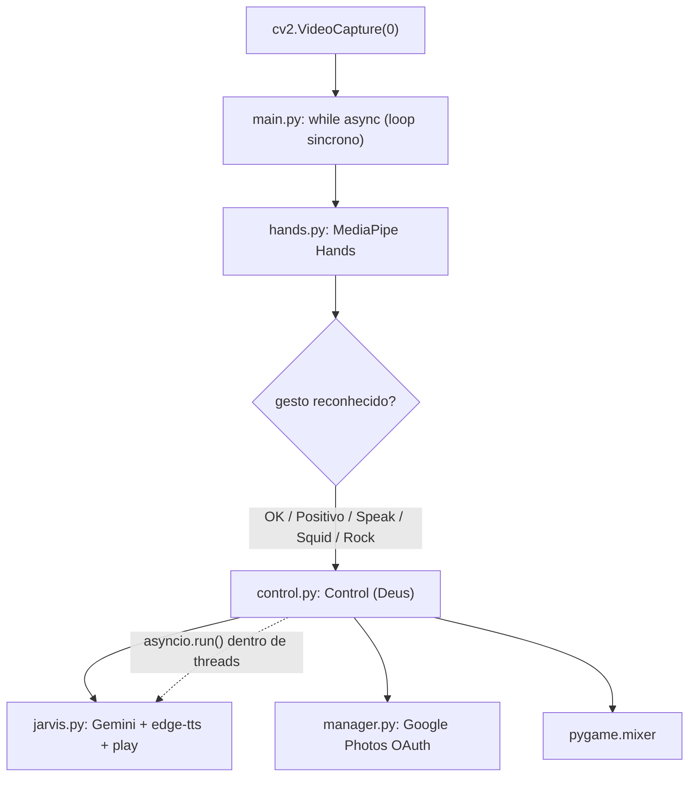
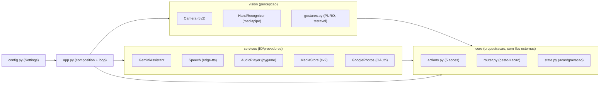

# Avaliacao e plano de refatoracao do Jarvis (camadas simples)

> **Status: aceito.** Este documento e o plano aprovado — nenhum codigo foi
> alterado ainda. A execucao comeca pela Onda 1.

## Sumario executivo

O Jarvis funciona e tem um nucleo de ideias bom (gestos -> acoes -> IA -> voz),
mas a arquitetura atual mistura responsabilidades, acopla diretamente aos
provedores externos (Gemini, edge-tts, Google Photos, OpenCV, pygame) e tem um
modelo de concorrencia fragil (asyncio + ThreadPoolExecutor misturados, com
`asyncio.run` dentro de threads). Ha **1 bug critico** (gesto Rock quebrado),
**5 defeitos de severidade alta** (concorrencia/bloqueio/segredos) e poluicao de
repo/dependencias.

- **Decisao (2026-06-27):** adotar **arquitetura em camadas simples**
  (`vision` / `core` / `services`) com **classes concretas** e **injecao por
  construtor** — testabilidade via fakes (duck typing), **sem `Protocol`/ABC**.
  Com testes (pytest), type hints + lint (ruff/mypy) e config/segredos saneados;
  empacotamento via `pyproject.toml` + `uv`.
- **Por que nao hexagonal puro:** seria **overkill** para 5 casos de uso num
  Raspberry Pi 3 (ports com implementacao unica = boilerplate; indirecao por
  frame custa CPU). O ganho real buscado e **testabilidade**, obtida com injecao
  + fakes sem o cerimonial de ports/adapters. Ver
  [Advogado do diabo](#parte-4--advogado-do-diabo). Alternativa escolhida: **Alt. 1**.

---

## Parte 1 — Julgamento da arquitetura atual

### 1.1 Fluxo atual



### 1.2 Problemas estruturais

| # | Problema | Evidencia | Principio ferido |
|---|----------|-----------|------------------|
| E1 | `Control` e uma **classe-Deus**: captura de foto/video/audio, orquestracao de IA, sons e regra de negocio juntos | [control.py](../../control.py) (toda a classe) | SRP |
| E2 | **Acoplamento direto** aos provedores; sem interface alguma. Trocar Gemini ou testar sem rede e impossivel | jarvis.py, manager.py, control.py | DIP / Inversao de dependencia |
| E3 | **Tudo na raiz** do repo, sem pacote, sem `src/`, sem `tests/` | layout do repo | Organizacao de pastas |
| E4 | **Concorrencia incoerente**: `async` por fora, `ThreadPoolExecutor` por dentro, `asyncio.run()` por thread; `nest-asyncio` no requirements e sintoma | main.py, control.py | Modelo de execucao |
| E5 | **Funcoes de gesto repetitivas** (Map_Ok/Positive/Speak/Squid/Rock quase identicas) e acopladas ao objeto MediaPipe | [hands.py](../../hands.py) | DRY / testabilidade |
| E6 | **Sem config central**: `.env`, paths, vozes, thresholds e scopes espalhados como literais | varios | Configuracao |
| E7 | **Sem rede de testes**, sem type hints, sem lint | repo | Qualidade |

### 1.3 Defeitos verificados (verificacao adversarial)

> Cada item foi confirmado lendo o codigo (`e_real=true`), exceto o ultimo.

| Sev. | Defeito | Local |
|------|---------|-------|
| **CRITICA** | `Video_Audio` chama `self.Capture_Audio` **sem** o argumento `executor` obrigatorio -> `TypeError`, gesto **Rock sempre quebra** | [control.py:109](../../control.py) |
| ALTA | `asyncio.run()` dentro de threads do `ThreadPoolExecutor` cria/destroi event loops por chamada (fragil; `nest-asyncio` e sintoma) | control.py:40,50,55,71,93,103,113 |
| ALTA | `time.sleep(10)` **bloqueante** no polling de `Video_To_Text` (async) — o proprio codigo chama de "Bomba" | [jarvis.py:93](../../jarvis.py) |
| ALTA | Loop de captura **sincrono** dentro de `main()` async **nunca cede** o event loop; o `await` em `Check_Gesture` e enganoso (sem suspensao real) | main.py:25-71 |
| ALTA | `Control_Video` como flag de parada **sem sincronizacao**, em **busy-loop 100% CPU**; **todo** gesto Async faz `Control_Video = not Control_Video`, corrompendo o estado de gravacao | main.py:92-94 / control.py:51 |
| ALTA | **Sem `.gitignore`** para `.env`, `env/`, `token.json`, `client_secret.json` — risco de versionar credenciais OAuth + chave Gemini | .gitignore |
| MEDIA | `requirements.txt` lista **stdlib** (`time`, `os`, `pathlib`), `google` (meta-pacote errado), **falta `requests`**, sem pinning | requirements.txt |
| MEDIA | `ProjectConfig.py` roda **efeito colateral no import**; `os.mkdir` sem `exist_ok` quebra na 2a vez; handle de `.env` vazado | ProjectConfig.py:4-9 |
| MEDIA | `uploadMidia` envia `.avi` com header **`image/jpeg` hardcoded** — upload de video corrompido/rejeitado | manager.py:47 |
| BAIXA | `Capture_Audio` retorna strings de erro ("Sem Pergunta"...) que viram **prompt** ao Gemini — mistura canal de erro/dados | control.py:79-84 |
| BAIXA | `Recycle_midia(midia_path)` **sem `self`** (codigo morto, bug latente; midia local nunca e limpa) | control.py:31 |
| BAIXA | `__pycache__/*.pyc` **versionados** (inclui bytecode de Python 3.9 e 3.12) | repo |
| info | `gesture_cooldown` global mutavel — divida de design, **nao** reproduz bug hoje (thread unica) | main.py:8,64,89 |

### 1.4 Pontos fortes (preservar)

- A separacao conceitual gesto -> acao -> IA -> voz e clara e correta.
- `hands.py` ja isola a deteccao de gestos (basta torna-la pura).
- O uso de Gemini multimodal (texto/imagem/video) e bem aproveitado.
- `manager.py` ja encapsula o OAuth do Google Photos num lugar.

---

## Parte 2 — Arquitetura-alvo (Camadas simples)

### 2.1 Principio

Tres camadas, dependencia num unico sentido. **Classes concretas** com
**injecao por construtor** — sem `Protocol`/ABC. O `core` (orquestracao +
gestos puros) **nao importa** `cv2`/`mediapipe`/`genai`/`edge_tts`/`pygame`/
`requests`; recebe as classes de servico ja instanciadas. Testes injetam
**fakes** por duck typing.



### 2.2 Arvore de pastas proposta

```
jarvis/                              # repo root (pacote instalavel via uv)
├── pyproject.toml                   # build, deps, ruff, mypy, pytest
├── uv.lock
├── .env.example                     # template de variaveis (sem segredos)
├── .gitignore                       # .env, secrets/, response/, midia/, __pycache__/
├── secrets/                         # runtime, gitignored (OAuth)
│   ├── client_secret.json
│   └── token.json
├── assets/sounds/                   # ex-audios_check/ (sons de confirmacao)
├── response/                        # runtime (gitignored) — TTS gerado
├── midia/                           # runtime (gitignored) — fotos/videos
├── src/jarvis/
│   ├── __main__.py                  # `python -m jarvis` -> app.run()
│   ├── app.py                       # composition: instancia tudo, injeta, roda o loop
│   ├── config.py                    # Settings (pydantic-settings; SecretStr p/ chave)
│   ├── vision/                      # PERCEPCAO (entrada)
│   │   ├── camera.py                # Camera (wrapper cv2.VideoCapture)
│   │   ├── recognizer.py            # HandRecognizer (MediaPipe -> landmarks)
│   │   └── gestures.py              # funcoes PURAS (ex-Map_*), zero libs externas
│   ├── core/                        # ORQUESTRACAO (regra de negocio)
│   │   ├── actions.py               # 5 acoes (foto, video, perguntar, imagem, video+IA)
│   │   ├── router.py                # gesto+mao+cooldown -> acao (ex-checks/Check_Gesture)
│   │   └── state.py                 # estado de acao/gravacao (substitui flags globais)
│   └── services/                    # IO / PROVEDORES (as libs vivem aqui)
│       ├── assistant.py             # GeminiAssistant (Gemini multimodal)
│       ├── tts.py                   # Speech (edge-tts synthesize)
│       ├── audio.py                 # AudioPlayer (pygame)
│       ├── store.py                 # MediaStore (imwrite/VideoWriter, delete)
│       └── photos.py                # GooglePhotos (upload OAuth)
└── tests/                           # pytest, sem hardware (fakes injetados)
    ├── conftest.py  fakes.py
    ├── test_gestures.py
    └── test_actions.py
```

### 2.3 Camadas (3)

| Camada | Responsabilidade | Importa |
|--------|------------------|---------|
| `vision` | Perceber: camera, reconhecedor de maos, **classificacao pura de gestos**. `gestures.py` e puro (so matematica sobre landmarks). | `cv2`/`mediapipe` so em `camera.py`/`recognizer.py`; `gestures.py` nada |
| `core` | Orquestrar: as 5 acoes, `router` (gesto->acao), `state` (acao/gravacao). | so `vision` (tipos) + servicos **injetados**. **Nunca** `cv2`/`genai`/`pygame` |
| `services` | Falar com o mundo: Gemini, edge-tts, pygame, Google Photos, disco. Encapsula tambem o `run_in_executor` do que e bloqueante. | as libs externas |

`app.py` (composition) instancia `services` + `vision`, injeta no `core` e roda
o loop. E o **unico** lugar que conhece as tres camadas.

### 2.4 Injecao por construtor, sem Protocol

```python
# core/actions.py — recebe instancias concretas, nao cria nada
class Actions:
    def __init__(self, store, photos, assistant, tts, player, state):
        self._store, self._photos = store, photos
        self._assistant, self._tts, self._player = assistant, tts, player
        self._state = state
```

Nos testes, `Actions(FakeStore(), FakePhotos(), FakeAssistant(), ...)` — duck
typing, sem `Protocol`/ABC. Type hints usam as classes concretas reais; mypy
valida o wiring no `app.py`. Ganha-se ~80% da testabilidade do hexagonal com
metade dos arquivos.

### 2.5 Classes de servico

`GeminiAssistant` (texto/imagem/video), `Speech` (edge-tts synthesize),
`AudioPlayer` (pygame play_and_wait), `MediaStore` (save_photo/record_video/
delete), `GooglePhotos` (upload OAuth). Cada uma e uma classe concreta coesa;
a concorrencia bloqueante (`run_in_executor`/polling) fica encapsulada aqui,
fora do `core`.

### 2.6 Config e segredos

`pydantic-settings` (`BaseSettings`) em `config.py` — leve para o RPi3.
`gemini_api_key: SecretStr` (obrigatorio), modelo/voz/thresholds/fps/cooldowns/
paths com defaults. OAuth movido para `secrets/` (gitignored), caminhos via
`Settings`. Dirs de runtime criados de forma **idempotente**
(`mkdir(parents=True, exist_ok=True)`) no `app.py` — fim do `ProjectConfig.py`
quebrado.

### 2.7 Mapeamento DE -> PARA (resumo)

| De (hoje) | Para (alvo) |
|-----------|-------------|
| `main.py` loop while | `app.py` (loop) |
| `main.py` checks + `Check_Gesture` + `gesture_cooldown` | `core/router.py` + `core/state.py` |
| `hands.py` `Map_*` | `vision/gestures.py` (puras) |
| `hands.py` Hands (mediapipe) | `vision/recognizer.py` |
| `main.py` cv2.VideoCapture | `vision/camera.py` |
| `control.py` Capture_Photo/Video | `core/actions.py` + `services/store.py` |
| `control.py` Capture_Audio | `services/` (transcricao) |
| `control.py` flags ACTION/Control_Video | `core/state.py` |
| `jarvis.py` Gemini | `services/assistant.py` |
| `jarvis.py` Translate (edge-tts) | `services/tts.py` |
| `jarvis.py`/`control.py` play+sleep | `services/audio.py` (AudioPlayer) |
| `manager.py` (Photos) | `services/photos.py` |
| `ProjectConfig.py` | `config.py` + criacao idempotente no `app.py` |
| `requirements.txt` | `pyproject.toml` + `uv.lock` (saneado) |
| `audios_check/` | `assets/sounds/` |
| `./env/*.json` | `secrets/*.json` (gitignored) |

---

## Parte 3 — Plano de refatoracao (7 ondas)

**Racional:** reduzir risco antes de reestruturar. Ondas 1-2 estabilizam (bugs,
concorrencia, segredos) **sem** mexer na arquitetura. Onda 3 instala a rede de
testes **antes** de mover codigo. Onda 4 extrai logica pura (alto valor, baixo
risco). Onda 5 reorganiza em pacote/camadas movendo o codigo com paridade. Onda 6
centraliza config, monta o `app.py` (composition) e resolve a fronteira async/
sync de vez, removendo a classe-Deus `Control`. Onda 7 limpa e endurece. Cada
onda e revertivel via `git` e validavel **sem hardware** (fakes injetados).

| Onda | Nome | Entrega | Risco |
|------|------|---------|-------|
| 1 | Estabilizar dores criticas | Bug Video_Audio, asyncio.run/sleep, toggle Control_Video, Recycle_midia | Medio-alto |
| 2 | Saneamento | `.gitignore` segredos, requirements limpo, `.env.example`, ProjectConfig idempotente | Baixo |
| 3 | Tooling (rede de seguranca) | `pyproject`+`uv`, ruff, mypy, pytest + smoke | Baixo-medio |
| 4 | Gestos puros | `Map_*` -> `vision/gestures.py` puras + testes | Baixo |
| 5 | Pacote em camadas | criar `src/jarvis`, mover codigo p/ `vision`/`core`/`services` (classes concretas), paridade | Medio-alto |
| 6 | Config + composition + async | `config.py` + `app.py`; fronteira async/sync resolvida; remove `Control` | Medio-alto |
| 7 | Finalizacao | Remove legado, mypy estrito, docs, smoke em RPi3 | Baixo (codigo) |

> **Resiliencia (em aberto):** ver [Parte 5](#parte-5--resiliencia-supervisao-e-reinicio)
> — decidir se entra uma camada de supervisao/watchdog (isolar falha + reiniciar)
> e em qual onda (provavelmente 6 e 7).

### Detalhe — Onda 1 (as dores prioritarias)

1. `control.py:109` -> `executor.submit(self.Capture_Audio, executor)`.
2. Mover `ACTION = True` para o inicio de `Video_Audio` (paridade com os outros).
3. Eliminar `asyncio.run()` nos workers: versao sincrona de `play_confirmation_sound`; para o Jarvis, loop dedicado por thread (`new_event_loop`+`run_until_complete`) **ou** tornar metodos sincronos — escolher o que preserva paridade com menor mudanca e registrar.
4. `jarvis.py:93`: `time.sleep(10)` -> backoff nao-bloqueante (`asyncio.sleep`) com timeout.
5. `main.py:92-94`: restringir o toggle de `Control_Video` **apenas** aos gestos que gravam video (hoje todo gesto Async alterna a flag).
6. `control.py:31`: `Recycle_midia` ganha `self`/`@staticmethod`.

> Cada correcao em **commit atomico** para rollback granular. Checkpoint: import
> sem erro + revisao linha-a-linha + smoke com hardware se disponivel.

*(Ondas 2-7 detalhadas na execucao; cada uma tem objetivo, passos, arquivos,
checkpoint de teste, risco e rollback.)*

---

## Parte 4 — Advogado do diabo

> Regra do projeto: criticar a abordagem e oferecer alternativas com tradeoffs.

**Critica ao alvo hexagonal:**

1. **Overkill para o escopo.** 5 casos de uso, ~5 dependencias, 1 processo, 1
   pessoa mantendo. Ports + adapters + use cases + composition root podem somar
   mais codigo que a regra de negocio. Mais interfaces = mais arquivos para
   navegar.
2. **Custo de runtime no RPi3.** Cada indirecao (chamada via `Protocol`,
   conversao de landmarks para tipo de dominio **por frame** a ~30fps) adiciona
   CPU/alocacao num hardware limitado. Medir antes; talvez manter o caminho
   quente (deteccao por frame) mais "cru".
3. **Arquitetura performativa.** Ports com uma unica implementacao "para sempre"
   sao boilerplate. Se nunca havera um 2o LLM/storage, o `Protocol` nao paga. O
   valor real aqui e **testabilidade** (injecao + fakes), nao
   **intercambiabilidade**.

**Alternativas (com tradeoff):**

- **Alt. 1 — Camadas simples (sem Protocols).** 3 modulos (visao / dominio / IO)
  com classes concretas e injecao por construtor. Ganha ~80% da testabilidade
  (fakes via duck typing) com metade dos arquivos. Perde a fronteira formal de
  interface. **Provavelmente o melhor custo-beneficio.**
- **Alt. 2 — Parada pragmatica (so Ondas 1-4).** Corrige bugs, saneia
  segredos/requirements, adiciona tooling e extrai logica pura de gestos.
  Resolve **todas as dores declaradas** com risco baixissimo. Nao entrega o
  "alvo hexagonal", mas pode ser onde o ROI da reestruturacao despenca.
- **Alt. 3 — Hexagonal seletivo.** Ports so no `LLMProvider` e `TextToSpeech`
  (onde testar sem rede e claramente valioso e uma troca de provedor e
  plausivel); camera/mic/storage ficam adapters concretos simples.

**Decisao (2026-06-27): adotada a Alt. 1 — Camadas simples.** Melhor
custo-beneficio para o escopo; entrega a testabilidade desejada sem o boilerplate
de ports/adapters. As Ondas 1-3 sao consenso e comecam ja; a reestruturacao em
camadas vem nas Ondas 5-6.

---

## Parte 5 — Resiliencia, supervisao e reinicio

> Levantado pelo dono (2026-06-27): "uma arquitetura que separa em camadas e isola
> o menor nucleo, e quando da problema o nucleo fica isolado e reinicia o sistema".

**O que e:** isso descreve **Microkernel (Plugin)** + **arvores de supervisao**
("let it crash", estilo Erlang/OTP / actor model). O nucleo minimo fica estavel e
isolado; falhas em componentes nao o derrubam; um supervisor **reinicia** o que
falhou (ou o processo todo) para um estado conhecido.

**Decisao:** **nao** adotar o estilo completo (microkernel/actor) — overkill e
contra a natureza do Python (sem processos verdes baratos; GIL). **Adotar so a
parte de resiliencia** que importa para um device sempre-ligado, como camada
fina sobre as camadas simples:

- **Isolamento por acao (bulkhead):** cada acao do `core` roda em `try/except`;
  uma falha (Gemini fora, mic ocupado) **nao mata o loop** de captura.
- **Supervisao de subsistemas:** `app.py` reinicia camera/recognizer em caso de
  falha de hardware, sem reiniciar o processo todo.
- **Watchdog de processo:** `systemd` com `Restart=always` (ou supervisor minimo)
  reinicia o processo se ele morrer — o "reinicia o sistema" de forma trivial e
  robusta, sem reinventar OTP.
- **Opcional:** *circuit breaker* nas chamadas de rede (Gemini/Photos) para nao
  martelar um servico fora do ar.

**Onde entra no plano:** isolamento por acao + supervisao de subsistemas na
**Onda 6** (ao montar `app.py`/`state`); watchdog `systemd` + circuit breaker na
**Onda 7** (finalizacao/deploy no RPi3).

---

## Decisao tomada / proximos passos

1. **Alvo aprovado:** camadas simples (Alt. 1) + camada fina de resiliencia
   (Parte 5).
2. Autorizar inicio da **Onda 1** (correcao de bugs) — independe do resto.
3. Apos cada onda, atualizar este doc; abrir ADR especifico se houver desvio.

## Registro de execucao

### Onda 1 — concluida (2026-06-27, working tree, sem commit)

**Decisoes aplicadas:** concorrencia "minimo seguro"; gravacao via
`threading.Event`; escopo: 4 nucleos + bonus (mime/erro do mic); Python 3.11+;
validacao estatica + suite pytest.

**Mudancas no codigo:**
- `control.py`: helper `_run` (1 event loop reutilizavel por thread) substitui
  `asyncio.run` nos workers; `play_confirmation_sound` agora **sincrono**;
  `Capture_Video` usa `_recording` (Event) com respiro no loop (fim do busy-loop
  a 100% CPU); `Capture_Audio` retorna `None` em falha (antes strings de erro
  viravam prompt); `Audio/Image/Video_Audio` capturam audio direto e so
  consultam o Jarvis se houver prompt; **bug do `Video_Audio` corrigido**
  (`Capture_Audio` recebe `executor`); `ACTION` setado no inicio.
- `main.py`: `Check_Gesture` agora **sincrono**; toggle de gravacao **so para
  gestos de video** (via `toggle_recording()`), e so submete o worker ao
  INICIAR; removido `import math`.
- `jarvis.py`: `Video_To_Text` troca `time.sleep(10)` por
  `await asyncio.sleep(backoff)` (a "Bomba"); removido `import time`.
- `manager.py`: `uploadMidia` deriva o mime via `mimetypes` — fim do `.avi`
  enviado como `image/jpeg`.

**Testes:** ja havia uma suite (criada em paralelo; equivale a parte da Onda 3 —
`pyproject.toml` com pytest+coverage, `asyncio_mode=auto`, conftest com mock
total das libs). Ela codificava o comportamento antigo (e marcava os bugs como
`xfail`). Atualizada ao contrato corrigido em `tests/test_main.py`,
`tests/test_control.py` e no fixture de sleep de `tests/test_jarvis.py`.
**Resultado: 187 passed, 1 xfailed.** Cobertura: control/jarvis/manager 100%;
`main.py` 45% (o loop de camera nao e testavel sem hardware).

**Deferido:** `Recycle_midia` (codigo morto, declarado sem `self`) ficou fora —
nao estava no escopo selecionado; permanece `xfail`. Saneamento de
segredos/requirements (Onda 2) e a reestruturacao em camadas (Onda 5-6) seguem.

### Onda 2 — concluida (2026-06-27, working tree + `git rm --cached`)

**Contexto:** parte da Onda 2 ja vinha do **trabalho paralelo** (ProjectConfig
idempotente + `test_project_config.py`; `.gitignore` cobrindo pycache/cobertura).
Revisao: `ProjectConfig.py` esta correto (`makedirs(exist_ok=True)`, `.env` em
append+close, guard `__main__`) — sem ajustes. Faltava o essencial: **segredos**.

**Mudancas:**
- `.gitignore`: secao de **segredos** (`.env`, `.env.*` com `!.env.example`,
  `env/`, `secrets/`, `token.json`, `client_secret.json`, `*credentials*.json`)
  e **dirs de runtime** (`response/`, `midia/`).
- `requirements.txt` saneado: removidos stdlib (`time`/`os`/`pathlib`),
  meta-pacote `google` e nao usados (`nest-asyncio`, `threadpoolctl`, `mpmath`,
  `playsound`, `oauth2client`, `google-oauth2-tool`). Adicionados os faltantes
  reais: `requests`, `google-auth` e **`PyAudio`** (backend de microfone do
  SpeechRecognition; pode exigir PortAudio no SO). Sem pin (uv.lock na Onda 3).
- `.env.example` criado (documenta `API_GEMINI` e onde ficam as credenciais OAuth).
- `git rm -r --cached __pycache__ tests/__pycache__`: bytecode (incl. 3.9/3.12/
  3.11) **destrackeado** do indice (segue no disco; agora ignorado).

**Verificacao (estatica + suite):** `git check-ignore` confirma os segredos e
dirs de runtime ignorados e `.env.example` rastreavel; `git ls-files` sem nenhum
`.pyc` nem segredo real; `requirements.txt` sem stdlib/invalidos; suite
**187 passed, 1 xfailed**. Sem `git commit`.

### Onda 3 — concluida (2026-06-27)

**Contexto:** `pytest`+`coverage` ja vinham do trabalho paralelo. Completei o
tooling (ambiente tinha uv 0.11 + ruff 0.15; mypy instalado via `uvx`).

**Mudancas:**
- `pyproject.toml`: `[project]` (name/version/`requires-python>=3.11` +
  `dependencies` espelhando o requirements limpo), `[dependency-groups].dev`
  (ruff, mypy, pytest, pytest-asyncio, pytest-cov), `[tool.uv] package=false`
  (projeto **virtual** — empacotamento real fica na Onda 5), `[tool.ruff]` +
  `[tool.ruff.lint]` (select `E,F,I,UP,B`; ignore `E501`; per-file-ignores para
  `tests/*` e `main.py`/`B023`) e `[tool.mypy]` (`ignore_missing_imports`, `files`
  = 6 modulos de producao).
- **`uv.lock`** gerado via `uv lock` (83 pacotes resolvidos).
- **ruff:** `ruff check --fix` (31 fixes seguros) + `ruff format` (14 arquivos).
  Restantes tratados conforme decisao:
  - `hands.py` — 45 `F841` (coordenadas nao usadas) **removidos** (autofix,
    validado pela suite).
  - `main.py` — 22 `B023` (lambdas com loop var) **ignorados** via per-file-ignore
    (chamadas na mesma iteracao; falso alarme; reestruturacao na Onda 6) +
    `zip(..., strict=True)`.
  - `manager.py` — removido o encadeamento morto `response_json/photo_id/photo_url`
    (buscava URL e descartava); `getPhotoUrl` permanece para uso futuro.
- `tests/test_manager.py` ajustado ao novo contrato (uploadMidia nao resolve mais URL).

**Comandos (uv):** `uv sync` (deps+dev), `uv run pytest`, `ruff check` /
`ruff format`, `uvx mypy`.

**Verificacao:** `ruff check` limpo, `ruff format --check` ok, `uvx mypy` sem
problemas, suite **187 passed, 1 xfailed**. Sem `git commit`.

### Onda 4 — concluida (2026-06-27)

**Mudancas:**
- **`gestures.py`** (novo): funcoes **puras** `is_ok`/`is_positive`/`is_speak`/
  `is_squid`/`is_rock` — recebem `(h, w, hand_landmarks)` (duck-typed: so precisam
  de `.landmark[i].x/.y`) e retornam `bool` — mais `distance` (euclidiana via
  `math.hypot`). Constantes nomeadas dos landmarks + `RAISED_MARGIN`. Tipado com
  `Protocol` (`Landmark`/`HandLandmarks`), sob mypy. **Geometria identica** aos
  `Map_*` originais (verificada condicao a condicao).
- **`hands.py`** reduzido de ~175 para ~40 linhas: virou **wrapper fino**. Os
  `Map_*` delegam para `gestures.*` preservando a assinatura `(h, w, lm, frame)` e
  o contrato legado True/None (`return True if pura() else None`). `import math`
  removido.
- **`tests/test_gestures.py`** (novo): testa as puras direto (canonico,
  exclusividade 5x5, pose neutra, default, contrato `bool`, `distance`), reusando
  os fixtures do conftest.
- `pyproject.toml`: `gestures.py` adicionado aos `files` do mypy.

**Verificacao:** `ruff check` limpo, `ruff format --check` ok, `uvx mypy` sem
problemas (7 modulos), suite **237 passed, 1 xfailed** (+50 testes; `test_hands.py`
segue verde validando o wrapper). Sem `git commit`.

**Nota:** a quirk True/None vive **so no wrapper**. Quando `main.py`/`hands.py`
forem reestruturados (Onda 5-6), o call-site passa a usar as puras (`bool`) e o
wrapper + a quirk somem.

### Onda 5 — concluida (2026-06-27)

**Decisoes (via AskUserQuestion):** seguir direto (piv_o de hardware "tres pilares"
registrado como **risco aceito** — ver nota abaixo); layout **`src/jarvis/`**; **so
relocacao** (nomes de metodos PascalCase preservados; rename snake_case fica na Onda 6);
**shim na raiz + `python -m jarvis`**.

**Reestruturacao para pacote em camadas (`src/jarvis/`):**

| Antes (raiz) | Depois |
|---|---|
| `gestures.py` | `src/jarvis/vision/gestures.py` |
| `hands.py` | `src/jarvis/vision/hands.py` |
| `jarvis.py` | `src/jarvis/services/jarvis.py` |
| `manager.py` | `src/jarvis/services/manager.py` |
| `control.py` | `src/jarvis/core/control.py` |
| `main.py` (loop) | `src/jarvis/core/loop.py` |
| `ProjectConfig.py` | `scripts/bootstrap.py` |

- **Movimentacao byte-exata** via `git mv` (tracked) / `mv` (gestures, untracked),
  preservando o conteudo das ondas anteriores; so as **linhas de import interno**
  foram reescritas para o pacote (`from jarvis.vision import gestures`,
  `from jarvis.services import jarvis`/`manager`, `from jarvis.core import control`).
- **Entry points:** `src/jarvis/__main__.py` (`python -m jarvis`, canonico) +
  **shim `main.py`** na raiz (compat `python main.py`; injeta `src/` no `sys.path`
  para rodar sem instalar). O `if __name__ == "__main__"` saiu do `loop.py`.
- **Empacotamento real** (era o plano anotado na Onda 3): `pyproject.toml` ganhou
  `[build-system]` (hatchling) + `[tool.hatch.build.targets.wheel]`; removido o
  `[tool.uv] package = false`. `uv lock` regenerado (83 pacotes).
- **Tooling repontado para o novo layout:** pytest `pythonpath = ["src", "scripts"]`
  (testes importam o pacote **sem instalar** -> CI com pip puro segue valido);
  coverage `source = ["src", "scripts"]` + omit `*/__main__.py`; mypy `mypy_path="src"`,
  `files=["src/jarvis","scripts/bootstrap.py","main.py"]`; ruff per-file-ignore
  movido (`B023` -> `src/jarvis/core/loop.py`; `E402` -> shim `main.py`).
- **Testes/conftest:** imports atualizados para o pacote (`from jarvis.* import ...`,
  `import bootstrap`); `test_main` passou a exercitar `jarvis.core.loop`; `test_smoke`
  importa os modulos por path dotado. **Logica de teste inalterada** (so imports).

**Verificacao:** `ruff check` limpo, `ruff format --check` ok (22 arquivos),
`uvx mypy` **Success (13 arquivos)**, suite **237 passed, 1 xfailed**, cobertura
**91%** (>= gate 85%). Sem `git commit` (working tree + index).

**Nota — risco aceito (piv_o de hardware):** existe um doc paralelo
[[../decisoes/2026-06-27_arquitetura_tres_pilares|arquitetura tres pilares]] (ESP32-S3
thin-client + cerebro no celular com VLM on-device). Se o produto pivotar, a estrutura
`vision/core/services` voltada ao RPi3 pode ser parcialmente descartada. O usuario optou
por seguir a Onda 5 mesmo assim; **fica o registro** para reavaliar antes da Onda 6.

## Referencias

- Codigo avaliado (pos-Onda 5): [loop.py](../../src/jarvis/core/loop.py),
  [control.py](../../src/jarvis/core/control.py),
  [jarvis.py](../../src/jarvis/services/jarvis.py),
  [hands.py](../../src/jarvis/vision/hands.py),
  [gestures.py](../../src/jarvis/vision/gestures.py),
  [manager.py](../../src/jarvis/services/manager.py),
  [bootstrap.py](../../scripts/bootstrap.py)
- [[../CONVENCOES|Convencoes da documentacao]]
- Arquitetura Hexagonal (Ports & Adapters), Alistair Cockburn — *a ingerir em
  `referencias/` se virar base de decisao formal*
